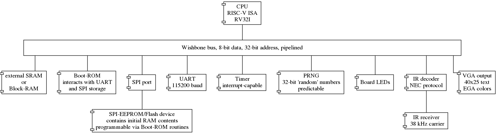

# SPU32

This is SPU32 ("Small Processing Unit 32"), a compact RISC-V processor implementing the RV32I instruction set.

A demo-SoC is also included, featuring some peripherals.

The project ist writting in Verilog and is designed to be synthesizable using the open-source [Yosys open synthesis suite](http://www.clifford.at/yosys/).

An overview of the SoC:

## CPU

### Vectors

Following vectors are used by the CPU and can be configured via parameters when instantiating the CPU module:

* `VECTOR_RESET`: The memory address where the CPU will start execution after reset. By default set to `0x00000000`
* `VECTOR_EXCEPTION`: The memory address where the CPU will jump to to handle interrupts (for example, external interrupts or software interrupts) and exceptions (for example, illegal instructions). By default set to `0x00000010`.

### Interrupts and exceptions

The CPU supports following types of interrupts and exceptions:

* software interrupts using the `ecall` and `ebreak` instructions
* external interrupts raised, e.g., by a peripheral device
* illegal/unknown instructions

If an interrupt of any type occurs, the CPU will jump to `VECTOR_EXCEPTION`, where a handling routine should be present.

The mode of interrupt/exception-handling is inspired by the privileged RISC-V specification, but much simplified for sake of implementation compactness. It therefore does not conform to an official specification, but should feel somewhat similar.

Interrupt- and exception-handling is controlled using machine-status registers that can be accessed using the `csrrw` instruction (the other csr-instructions are not supported in hardware and will raise an illegal-instruction exception, which can be handled in software if so desired). All status-registers have a read-write address (to allow swapping values with normal registers) and read-only address (to allow reading status-registers without changing their contents).

Following machine-status registers (MSRs) are used to control interrupt/exception-handling:

#### MSR_STATUS

* read-only address: `0xFC0`
* read-write address: `0x7C0`

Following information is encoded:

* `MSR_STATUS[31-3]`: reserved, always reads zero
* `MSR_STATUS[2]`: status of external interrupt line, i.e., `1` if an external interrupt is currently requested
* `MSR_STATUS[1]`: previous state of the external interrupt enable flag (`meie_prev`)
* `MSR_STATUS[0]`: current state of the external interrupt enable flag (`meie`)

When an interrupt/exception occurs, the value of `meie` is saved to `meie_prev`. The `meie`-flag is set to zero, which ensures that external interrupts are ignored until the current interrupt is handled or the `meie`-flag is reinstated.

The `mret`-instruction is used to return from an interrupt/exception. `meie` is set to the value of `meie_prev` and execution is resumed at the address stored in `MSR_EPC`.

On reset, `meie` is set to zero, which means that external interrupts will be ignored. To enable external interrupts, `meie` needs to be set to `1`.

Software-interrupts are always processed.

#### MSR_CAUSE

* read-only address: `0xFC1`
* read-write address: `0x7C1`

This status-register encodes the cause of of the raised interrupt/exception:

| `MSR_CAUSE[31]` | `MSR_CAUSE[3-0]` | type of exception |
| --- | --- | --- |
| 1 | 1011 | external interrupt |
| 0 | 0010 | invalid instruction |
| 0 | 0011 | `ebreak`-instruction |
| 0 | 1011 | `ecall`-instruction |

`MSR_CAUSE[30]` to `MSR_CAUSE[4]` are reserved and always read as zero.

Note that `MSR_CAUSE[31]` can be used to easily distinguish external interrupts from software-interrupts. A neat effect of this encoding is that external interrupt and software-interrupts can be distinguished by signed comparison with zero, e.g., by using the `bltz` (branch if less than zero) instruction.

#### MSR_EPC

* read-only address: `0xFC2`
* read-write address: `0x7C2`

This status-register contains the address of the instruction where the last interrupt/exception occurred. The `mret`-instruction will jump to the address stored in this status-register.

**Please note**: In case of software interrupts/exceptions, this status-register will point to the instruction that caused the interrupt/exception. When directly issuing `mret`, execution will resume at exactly the same instruction, which means that yet another interrupt/exception will be raised immediately. To resume normal program flow, one needs to increment the value of `MSR_EPC` by `4` (i.e., by the length of one instruction) to resume execution a the next instruction. This can be detected by `MSR_CAUSE[31]`.

External interrupts directly resume execution at the address stored in `MSR_EPC`, so no increment is needed prior to `mret`.

#### MSR_EVECT

* read-only address: `0xFC3`
* read-write address: `0x7C3`

This status-register specifies the memory address the CPU will jump to when an interrupt/exception occurs. By default initialized to `VECTOR_EXCEPTION`, but may be changed to any memory address where an interrupt service routine is located.
